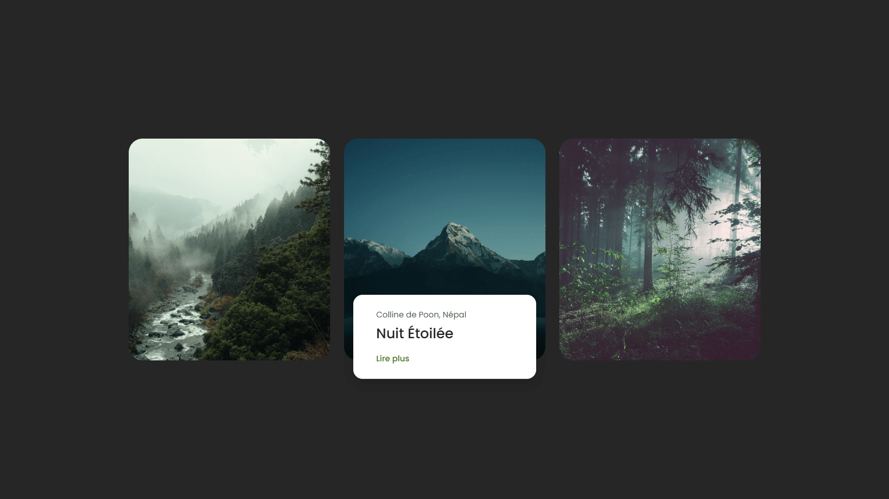

<div align="center">  
  <a href="https://card-hover-effects-1.netlify.app/" target="_blank">  
      
  </a>  
  </br></br>  
  <h3 align="center">🏞 Cartes avec Effet de Survol</h3>  
</div>

## <br /> 📌 Sommaire

&nbsp;&nbsp;&nbsp; 🎨 &nbsp; [**Introduction**](#introduction)<br />
&nbsp;&nbsp;&nbsp; 🛠️ &nbsp; [**Technologies**](#technologies)<br />
&nbsp;&nbsp;&nbsp; 🎯 &nbsp; [**Fonctionnalités**](#fonctionnalités)<br />
&nbsp;&nbsp;&nbsp; 🚀 &nbsp; [**Installation**](#installation)<br />

## <br /> <a name="introduction">🎨 Introduction</a>

Composants de cartes interactives animées en HTML et CSS pur avec effet de survol dynamique.

Chaque carte combine un visuel attractif, un texte descriptif et un bouton d'action, le tout révélé élégamment au survol.

Design responsive, animations fluides en pur CSS, parfait pour portfolios, galeries, etc...

## <br /> <a name="technologies">🛠️ Technologies</a>

- HTML5 structuré et sémantique
- CSS3 moderne (variables CSS, media queries, animations)
- Responsive Design avec breakpoints
- Aucune dépendance JS : 100% CSS natif

## <br /> <a name="fonctionnalités">🎯 Fonctionnalités</a>

- Apparition animée du texte lors du survol de l’image
- Design responsive multi-colonnes : 1, 2 ou 3 cartes selon la taille d’écran
- Transitions douces et effets CSS : `@keyframes`, `:hover`
- Images et données facilement modifiables
- Aucune librairie externe requise

## <br /> <a name="installation">🚀 Installation</a>

### ✅ Prérequis

- [Google Chrome](https://www.google.com/) &nbsp;—&nbsp; Navigateur moderne
- [Visual Studio Code](https://code.visualstudio.com/) &nbsp;—&nbsp; Éditeur de code
- [Live Server](https://marketplace.visualstudio.com/items?itemName=ritwickdey.LiveServer) &nbsp;—&nbsp; Extension VS Code

### 📥 Cloner le projet

```bash
git clone https://github.com/ValentinMadiot/card-hover-effects_css
```

### ▶️ Lancer le projet

Il suffit d’ouvrir le fichier `index.html` dans un navigateur, ou d’utiliser l’extension **Live Server** sur VS Code pour un aperçu dynamique.
